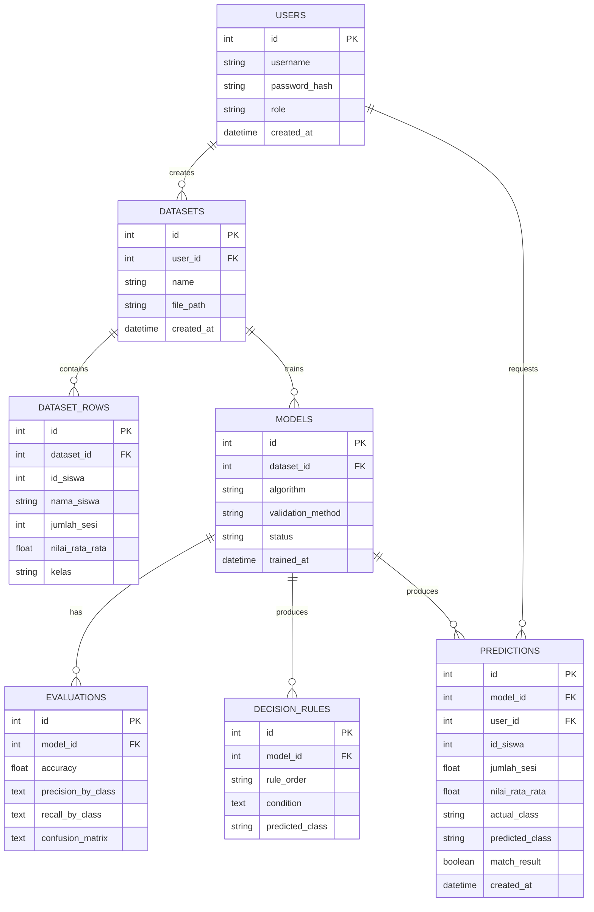

# Entity Relationship Diagram

```mermaid
erDiagram
    USERS ||--o{ DATASETS : creates
    DATASETS ||--o{ DATASET_ROWS : contains
    DATASETS ||--o{ MODELS : trains
    MODELS ||--o{ EVALUATIONS : has
    MODELS ||--o{ DECISION_RULES : produces
    MODELS ||--o{ PREDICTIONS : produces
    USERS ||--o{ PREDICTIONS : requests

    USERS {
        int id PK
        string username
        string password_hash
        string role
        datetime created_at
    }

    DATASETS {
        int id PK
        int user_id FK
        string name
        string file_path
        datetime created_at
    }

    DATASET_ROWS {
        int id PK
        int dataset_id FK
        int id_siswa
        string nama_siswa
        int jumlah_sesi
        float nilai_rata_rata
        string kelas
    }

    MODELS {
        int id PK
        int dataset_id FK
        string algorithm
        string validation_method
        string status
        datetime trained_at
    }

    EVALUATIONS {
        int id PK
        int model_id FK
        float accuracy
        text precision_by_class
        text recall_by_class
        text confusion_matrix
    }

    DECISION_RULES {
        int id PK
        int model_id FK
        string rule_order
        text condition
        string predicted_class
    }

    PREDICTIONS {
        int id PK
        int model_id FK
        int user_id FK
        int id_siswa
        float jumlah_sesi
        float nilai_rata_rata
        string actual_class
        string predicted_class
        boolean match_result
        datetime created_at
    }
```
