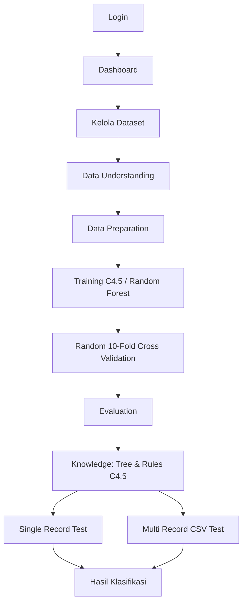

# User Flow

```mermaid
flowchart TD
    A[Login] --> B[Dashboard]
    B --> C[Kelola Dataset]
    C --> D[Data Understanding]
    D --> E[Data Preparation]
    E --> F[Training C4.5 / Random Forest]
    F --> G[Random 10-Fold Cross Validation]
    G --> H[Evaluation]
    H --> I[Knowledge: Tree & Rules C4.5]
    I --> J[Single Record Test]
    I --> K[Multi Record CSV Test]
    J --> L[Hasil Klasifikasi]
    K --> L
```
